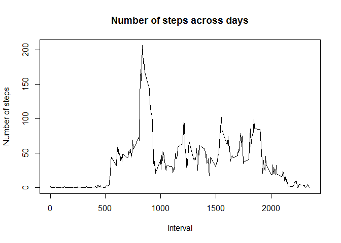
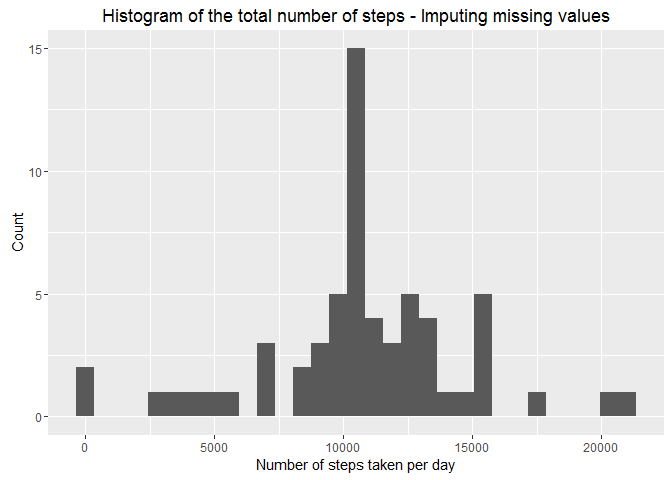
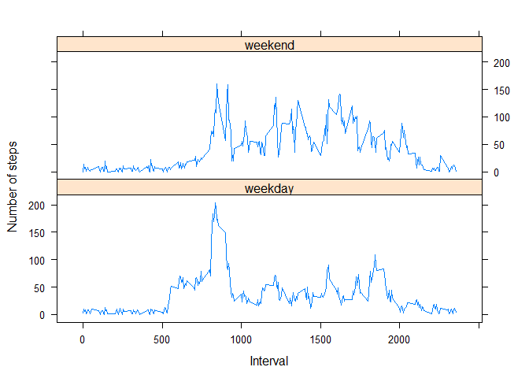

# Reproducible Research: Peer Assessment 1


## Loading and preprocessing the data

```r
data <- read.csv("activity.csv")
## Calculate the total number of steps taken per day
sumStepsByDay <- aggregate(steps ~ date, data, sum)
```

## What is mean total number of steps taken per day?
**Make a histogram of the total number of steps taken each day**

```r
hist(sumStepsByDay$steps, xlab = "Number of steps", ylab = "Frequency", main = "Histogram of the total number of steps taken each day", breaks=50, col = "red")
```

<!-- -->

**Calculate and report the mean and median of the total number of steps taken per day**

```r
meanStepsByDay <- mean(sumStepsByDay$steps)
medianStepsByDay <- median(sumStepsByDay$steps)
```
- Mean of the total number of steps taken per day value = **1.0766189\times 10^{4}**  
- Median of the total number of steps taken per day value = **10765** 

## What is the average daily activity pattern?  
**Make time series plot of the 5-minute interval and the average number of steps taken across all days**

```r
data2 <- aggregate(steps ~ interval, data, mean)
maxIntervalSteps <- data2[data2$steps==max(data2$steps), 1]

plot(data2, type="l", xlab="Interval", ylab="Number of steps", main="Number of steps across days")
```

<!-- -->

- Interval **835** contains the maximum number of steps, on average across all the days in the dataset  

## Imputing missing values
**Calculate and report the total number of missing values in the dataset**

```r
NumberOfMissing <- nrow(data[is.na(data$steps) == TRUE, ])
```
- Total number of missing values in the dataset is 2304  

**Devise a strategy for filling in all of the missing values in the dataset**  
My strategy for filling the missing (steps) values is a mixed approach comprises of 2 steps  
- Step 1: set missing steps value on a particular day with the mean value (across all intervals) of that day, if the number of observations whose steps values are present is higher than, say 75% out of all observations of that day  
- Step 2: fill missing values of the rest observations with mean for the same 5-minute interval  

**Create a new dataset that is equal to the original dataset but with the missing data filled in**

```r
imputeddata <- data
cPFRatio <- 0.75
missingData <- imputeddata[is.na(imputeddata$steps) == TRUE, c("date", "interval")]

FByDate <- aggregate(steps ~ date, imputeddata, FUN=function (x) c(Mean = mean(x), Count = length(x)))
MByDate <- aggregate(interval ~ date, missingData, length)
mergeData <- merge(FByDate, MByDate, by.x="date", by.y="date")
mergeData$PFRatio <- (1 - mergeData$interval / (mergeData$steps[, "Count"] + mergeData$interval))

mergeData <- mergeData[mergeData$PFRatio >= cPFRatio,]


library(data.table)
## Filling Step 1 (set missing value with mean value of day)
setDT(imputeddata)[mergeData, steps := ifelse(is.na(steps) == TRUE, mergeData$steps[, "Mean"], steps), on = "date"]

## Filling Step 2 (set missing value with mean value of 5-minute interval)
FByInterval <- aggregate(steps ~ interval, imputeddata, mean)
setDT(imputeddata)[FByInterval, steps := ifelse(is.na(steps) == TRUE, as.integer(FByInterval$steps), steps), on = "interval"]
```

**Make a histogram of the total number of steps taken each day**

```r
sumStepsByDay2 <- aggregate(steps ~ date, imputeddata, sum)
hist(sumStepsByDay2$steps, xlab = "Number of steps taken per day", ylab = "Frequency", main = "Histogram of the total number of steps - Imputing missing values", breaks=50, col = "red")
```

<!-- -->

```r
## Calculate and report the mean and median total number of steps taken per day
meanStepsByDay2 <- mean(sumStepsByDay2$steps)
medianStepsByDay2 <- median(sumStepsByDay2$steps)
```
**Calculate and report the mean and median total number of steps taken per day after imputing missing values**  
- New Mean of the total number of steps taken per day value = **1.074977\times 10^{4}**  
- New Median of the total number of steps taken per day value = **10641**  
- The new mean and median total number of steps taken per day in 2nd calculation after inputing missing data are smaller than the ones in 1st calculation.

## Are there differences in activity patterns between weekdays and weekends?  
**Create a new factor variable in the dataset with two levels - "weekday" and "weekend" indicating whether a given date is a weekday or weekend day.**

```r
imputeddata$wkday <- ifelse(format(as.Date(imputeddata$date, "%Y-%m-%d"), "%a") %in% c("Sat","Sun"), "weekend", "weekday")
```
**Make a panel plot containing a time series plot (i.e. type = "l") of the Interval (x-axis) and the average number of steps taken, averaged across all weekday days or weekend days (y-axis)**

```r
data3 <- aggregate(steps ~ interval+wkday, imputeddata, mean)
library(lattice)
xyplot(steps ~ interval | wkday, data = data3, type="l", layout = c(1, 2), xlab="Interval", ylab="Number of steps")
```

<!-- -->

**There are some differences in activity patterns between weekdays and weekends**  
- weekdays have higher number of steps (activities) during interval 500 to 1000  
- weekends have higher number of steps (activities) during interval 1000 to 2000
